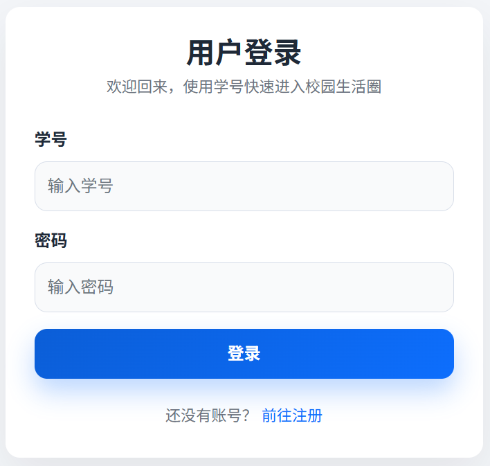
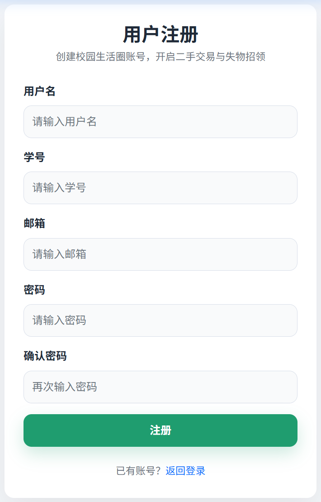
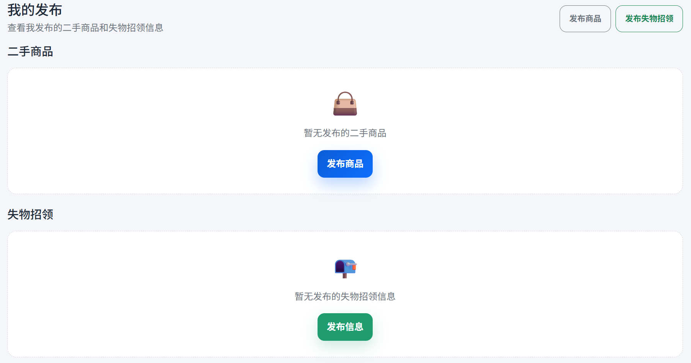
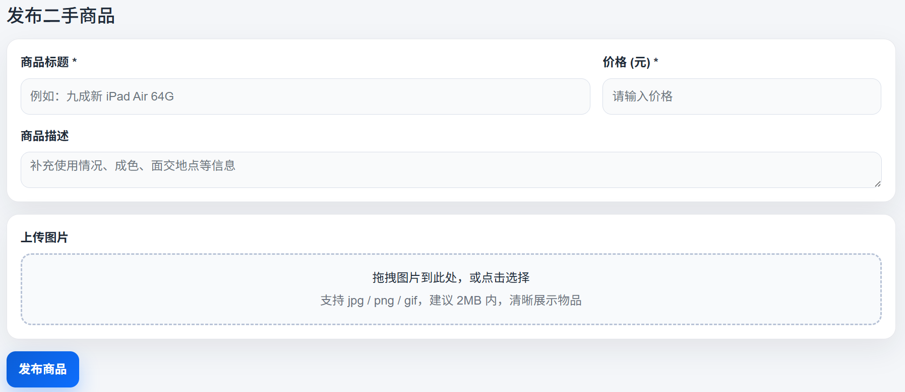
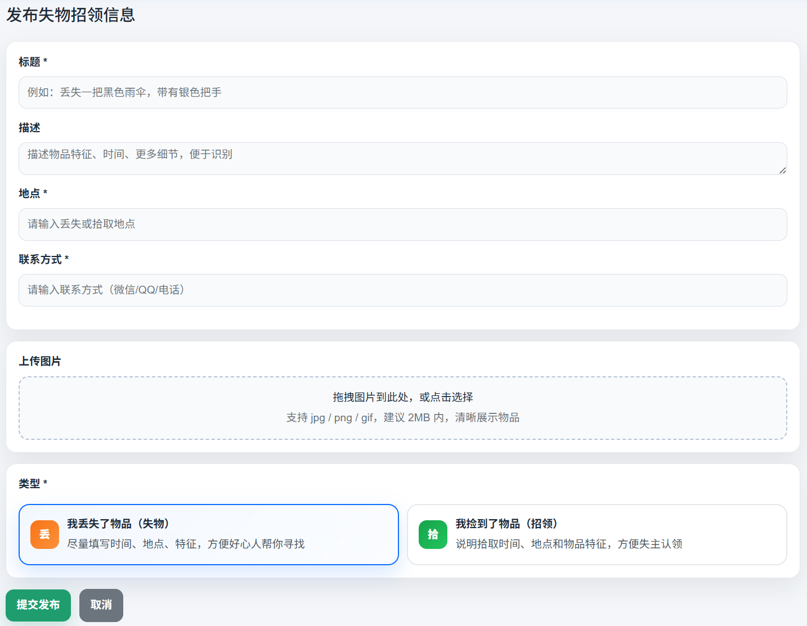

# 校园生活圈 (Campus Life Circle)

[](https://www.python.org/)
[](https://flask.palletsprojects.com/)
[](LICENSE)

> 一个基于 Python 开发的面向高校学生的综合性校园服务平台，采用前后端分离架构，提供**二手交易**和**失物招领**两大核心功能，并支持**站内消息**系统便于用户之间进行沟通联系。

---

## 目录

- [核心功能](#核心功能)
- [截图预览](#截图预览)
- [技术栈](#技术栈)
- [项目结构](#项目结构)
- [快速开始](#快速开始)
- [许可证](#许可证)

---

## 核心功能

### 平台功能
- **二手交易市场** - 发布、浏览、搜索二手商品，支持图片上传
- **失物招领** - 发布丢失/拾取物品信息，状态跟踪管理
- **站内消息系统** - 用户间私信沟通，关联具体商品/失物帖子
- **统一搜索** - 跨类型混合搜索，关键字过滤
- **随机浏览** - 发现更多内容，增加用户粘性

### 用户功能
- 用户注册/登录（学号认证）
- 个人中心
- 我的发布（查看自己发布的所有内容）
- 未读消息实时提醒
- 商品/失物状态管理

---

## 截图预览

**1. 登录 & 注册页面**：

<div align="center">
  
</div>

<div align="center">
  
</div>

**2. 首页主页面**：

<div align="center">
  
</div>

**3. 我的发布**：

<div align="center">
  
</div>

**4. 发布二手商品**：

<div align="center">
  
</div>

**5. 发布失物招领**：

<div align="center">
  
</div>

-----

## 技术栈

| 层级     | 技术选型            |
| -------- | ------------------- |
| 后端框架 | Flask (Python)      |
| 数据库   | SQLite              |
| 前端框架 | Flask + Bootstrap 5 |
| 认证机制 | Token-based         |
| 密码加密 | Flask-Bcrypt        |
| 跨域处理 | Flask-CORS          |

-----

## 项目结构

```
campus-life-circle/
├── backend/                    # 后端应用 (端口: 5000)
│   ├── app.py                  # 应用工厂与入口
│   ├── config.py               # 统一配置管理
│   ├── ext.py                  # 扩展实例初始化
│   ├── models.py               # 数据模型定义
│   ├── utils.py                # 工具函数
│   ├── auth_routes.py          # 认证路由
│   ├── item_routes.py          # 二手商品路由
│   ├── lost_routes.py          # 失物招领路由
│   ├── search_routes.py        # 搜索路由
│   ├── message_routes.py       # 站内信路由
│   ├── common/                 # 公共工具模块
│   │   ├── file_utils.py       # 文件上传工具
│   │   ├── pagination.py       # 分页工具
│   │   ├── response.py         # 统一响应格式
│   │   ├── errors.py           # 错误处理类
│   │   └── query_utils.py      # 查询工具
│   ├── instance/               # 数据库文件目录
│   └── static/uploads/         # 图片上传目录
│
├── frontend/                   # 前端应用 (端口: 5001)
│   ├── frontend_app.py         # 前端应用入口
│   ├── views.py                # 前端路由视图
│   ├── templates/              # Jinja2模板
│   └── static/
│       ├── css/main.css        # 主样式文件
│       └── js/                 # JavaScript模块
│           ├── config.js       # 全局配置
│           └── toast.js        # Toast提示组件
│
├── requirements.txt            # Python依赖
└── README.md                   # 本文件
```

------

## 快速开始

### 1. 环境准备

确保已安装 Python 3.10 或更高版本：

```bash
python --version
# Python 3.10.x 或更高
```

### 2. 克隆项目

```bash
git clone https://github.com/yourusername/campus-life-circle.git
cd campus-life-circle
```

### 3. 创建虚拟环境

**使用 venv:**

```bash
python -m venv venv
source venv/bin/activate  # Linux/Mac
venv\Scripts\activate     # Windows
```

**或使用 conda:**
```bash
conda create -n campus python=3.10
conda activate campus
```

### 4. 安装依赖

```bash
pip install -r requirements.txt
```

### 5. 启动后端服务

```bash
cd backend
python app.py
```

后端API将运行在 `http://127.0.0.1:5000`

### 6. 启动前端服务

打开新的终端窗口：

```bash
cd frontend
python frontend_app.py
```

前端应用将运行在 `http://127.0.0.1:5001`

### 7. 访问应用

在浏览器中打开: `http://127.0.0.1:5001`

-------

## 许可证

本项目基于 [MIT License](LICENSE) 开源，你可以自由学习、修改和分发。

```
MIT License

Copyright (c) 2026 Tianxiang Li

Permission is hereby granted, free of charge, to any person obtaining a copy
of this software and associated documentation files (the "Software"), to deal
in the Software without restriction, including without limitation the rights
to use, copy, modify, merge, publish, distribute, sublicense, and/or sell
copies of the Software, and to permit persons to whom the Software is
furnished to do so, subject to the following conditions:

The above copyright notice and this permission notice shall be included in all
copies or substantial portions of the Software.
```

---

> 如果你在学习过程中有任何问题，欢迎提交 [Issue](https://github.com/[YourUsername]/MusicPlayer4/issues) 或 [Pull Request](https://github.com/[YourUsername]/MusicPlayer4/pulls)。祝你学习愉快！
>
> ⭐ 如果这个项目对你有帮助，欢迎 Star 支持！
